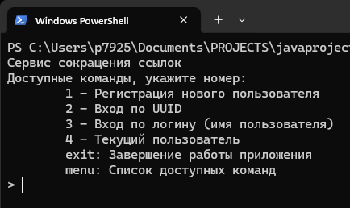
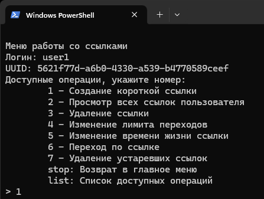

# Сервис коротких ссылок
## Итоговый проект по курсу «Программирование на языке Java»


Сервис коротких ссылок представляет собой консольное приложение, которое позволяет преобразовать длинные URL ссылки на интернет-ресурсы в короткие, например:  
-	длинная ссылка: https://aftershock.news/?q=node/1464908  
-	короткая ссылка: clck.ru/3DZHeG

Ссылка на репозиторий https://github.com/idAndrey/shorl-url.git

## Описание работы сервиса

Программа создает короткие ссылки из обычных ссылок на интернет-ресурсы.
Пользователь может создавать несколько коротких ссылок на разные ресурсы.
Система идентифицирует пользователя по UUID и генерирует уникальную ссылку при каждом запросе.
При повторном запросе сокращения той же ссылки генерируется новая короткая ссылка.
Сервис поддерживает работу нескольких пользователей, каждый из которых может создавать уникальные короткие ссылки.
Разные пользователи получают разные короткие ссылки на один и тот же URL.
При вводе короткой ссылки в консоль осуществляется переход на оригинальный ресурс.
Конфигурационный файл хранит параметр работы ссылки.
При добавлении ссылки пользователь может указать время существования ссылки.
Максимальное время хранения ссылки определяется меньшим значением из введённого пользователем и указанного в конфигурационном файле.
По истечении срока действия ссылки она удаляется автоматически.
При достижении лимита переходов ссылка удаляется автоматически.
Пользователь вводит лимит переходов, и система выбирает большее из введённого пользователем значения и значения, заданного в конфигурационном файле.
У пользователя есть возможность изменять лимит переходов по ссылке.
Пользователь может удалять свои ссылки.
Только создатель ссылки может редактировать параметры ссылки или удалять её.
Возможность редактирования и удаления ссылки доступна только создателю ссылки, идентифицируемому по UUID.
Когда ссылка становится недоступной из-за исчерпания лимита переходов или истечения времени её жизни, пользователь получает уведомление


Сервис поддерживает работу нескольких пользователей, и для одного и того же ресурса, но для разных пользователей создает, уникальные ссылки. Короткая ссылка имеет срок действия и лимит переходов. Пользователь может устанавливать срок действия ссылки и  величину лимита переходов. По истечении срока действия или достижении лимита переходом ссылка блокируется и удаляется, а пользователь получает уведомление в виде сообщения на консоль.
Для начала работы с сервисом необходимо зарегистрировать нового пользователя, которому присваивается уникальный идентификатор UUID. Авторизация по паролю не требуется, однако для удобства работы пользователь может зайти в систему по логину, в качестве которого используется имя пользователя, при этом система получает UUID, созданные при регистрации данного пользователя и связанный с его логином.
После авторизации пользователю доступны следующие операции с короткими ссылками:
-	Создание короткой ссылки
-	Просмотр всех ссылок пользователя
-	Удаление ссылки
-	Изменение лимита переходов
-	Изменение времени жизни ссылки
-	Переход по ссылке
-	Удаление устаревших ссылок  

Меню является текстовым, для выбора операции необходимо указать её номер и ввести в консоль.
Все введённые данных хранятся в оперативной памяти до тех пор, пока программа работает. При повторном запуске ранее введённые данные удаляются.  
Настройки программы находятся в конфигурационном файле **application.properties** в папке ..\src\main\resources

## Доступные функции

- Регистрация пользователей и присвоение уникального UUID  
- Авторизация по UUID или логину для работы с личными ссылками  
- Создание коротких ссылок  
- Просмотр действительных ссылок  
- Изменение лимита переходов и срока действия ссылки  
- Удаление ссылки  
- Уведомления о недоступности ссылки  
- Удаление недействительных ссылок  

## Какие команды поддерживаются
### Команды главного меню
После запуска доступны следующие команды:

- 1 - Регистрация нового пользователя  
- 2 - Вход по UUID  
- 3 - Вход по логину (имя пользователя)  
- 4 - Текущий пользователь  
- exit: Завершение работы приложения  
- menu: Список доступных команд  

Для завершения работы с программой нужно ввести 'exit'  
Для вывода списка команд нужно ввести 'menu'  




https://raw.githubusercontent.com/idAndrey/short-url/main/.github/images/{asset_name}.{asset_extension}

### Операции для работы с ссылками  

После входа в сервис пользователь может выполнить следующие операции со ссылками

- 1 - Создание короткой ссылки  
- 2 - Просмотр всех ссылок пользователя  
- 3 - Удаление ссылки  
- 4 - Изменение лимита переходов  
- 5 - Изменение времени жизни ссылки  
- 6 - Переход по ссылке  
- 7 - Удаление устаревших ссылок  
- stop: Возврат в главное меню  
- list: Список доступных операций  

Для завершения работы со ссылками и возврата в главное меню нужно ввести 'stop'  
Для вывода списка доступных операций нужно ввести 'list'  



## Установка
### Клонирование репозитория
Для установки программы скачайте архив репозитория по ссылке или склонируйте его  
```bash
git clone https://github.com/idAndrey/shorl-url.git  
cd short-url
```  
Для работы сервиса внешние библиотеки не требуются  

### Структура проекта

```plaintext
short-url-main
├─ pom.xml                  
├─ README.md
├─ .gitignore
└─ src
   ├─ main
      ├─ java
      │  ├─ shortlinkapp
      │  │  ├─ app
      │  │  │  ├─ Config.java
      │  │  │  ├─  ConsoleApp.java
      │  │  │  └─ ConsoleService.java
      │  │  ├─ link
      │  │  │  ├─ ShortLink.java
      │  │  │  ├─ ShortLinkRepository.java
      │  │  │  └─ ShortLinkService.java
      │  │  └─ user
      │  │     ├─ User.java
      │  │     ├─ UserRepository.java
      │  │     └─ UserService.java
      │  └─ ConsoleAppMain.java  
      └─ resources
         └─ application.properties
```
### Описание модулей  
Модули сервиса размещены в пакете **shortlinkapp**, в пакетах соответственно:
-	***app***, пакет с классами для запуска программы, авторизации, работы с меню;
-	***link***, пакет с классами для работы с короткими ссылками;
-	***user***, пакет с классами для работы с данными пользователей сервиса.


## Как протестировать ваш код
Способ тестирования кода


<!--Поддержка-->
## Поддержка
Если у вас возникли сложности или вопросы по использованию программы, создайте 
[обсуждение](https://github.com/idAndrey/issues/new/choose) в данном репозитории или связитесь с разработчиком по электронной почте <ermakov.andrey@ya.ru> или телеграм @pc022979700.
